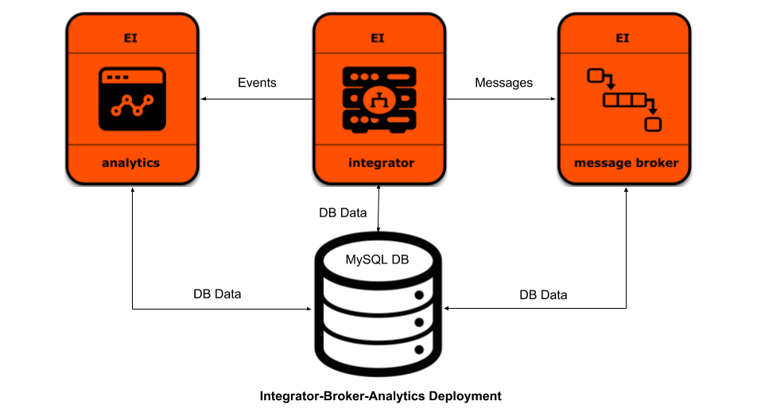

# Evaluate WSO2 Enterprise Integrator   With Docker Compose

Docker Compose is a tool for defining and running multi-container Docker applications.  
Here lies docker-compose files to help you evaluate WSO2 Enterprise Integrator for its various product features.
 
## Most common deployment profiles :
#### 1. Integrator with Analytics : Try out [here](https://github.com/wso2/docker-ei/tree/6.6.x/docker-compose/integrator-analytics)
  
  
  
#### 2. Integrator and Broker with Analytics : Try out [here](https://github.com/wso2/docker-ei/tree/6.6.x/docker-compose/integrator-broker-analytics)
  
  
