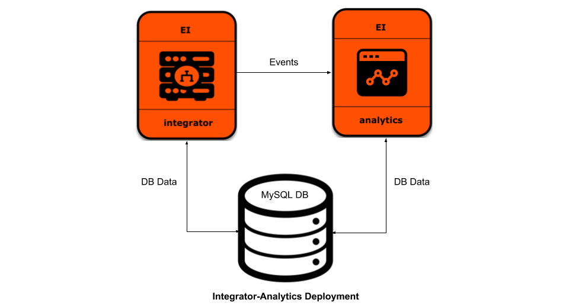

# WSO2 Enterprise Integrator <br> For Integration Use-cases With Analytics Support



## Prerequisites

 * Install [Git](https://git-scm.com/book/en/v2/Getting-Started-Installing-Git), [Docker](https://www.docker.com/get-docker) and
   [Docker Compose](https://docs.docker.com/compose/install/#install-compose)
   in order to run the steps provided in following Quick start guide. <br><br>
 * In order to use Docker images with WSO2 updates, you need an active WSO2 subscription. If you do not possess an active WSO2
   subscription, you can sign up for a WSO2 Free Trial Subscription from [here](https://wso2.com/free-trial-subscription).
   Otherwise, you can proceed with Docker images which are created using GA releases.<br><br>
 * If you wish to run the Docker Compose configuration using Docker images built locally, build the Enterprise Integrator's Integrator, Analytics Dashboard and Analytics Worker
   images using [EI Dockerfiles](../../dockerfiles) and remove the `docker.wso2.com/` prefix from the `image` name in the `docker-compose.yml`.
   For example, change the line `image: docker.wso2.com/wso2ei-integrator:6.5.0` to <br> `image: wso2ei-integrator:6.5.0`. <br><br>
       
## How to Run


  1. Clone WSO2 Enterprise Integrator Docker git repository.
  
     ```
     git clone https://github.com/wso2/docker-ei
     ```
     > If you are to try out an already released zip of this repo, please ignore this 1st step. 

  2. Switch to the `docker-compose/integrator-analytics` folder.
  
     ```
     cd docker-ei/docker-compose/integrator-analytics
     ```
     > If you are to try out an already released zip of this repo, please ignore this 2nd step also. 
     Instead, extract the zip file and directly browse to `docker-ei-<released-version>/docker-compose/integrator-analytics` folder. 
     
     > If you are to try out an already released tag, after executing 2nd step, checkout the relevant tag, 
     i.e. for example: <br> git checkout tags/v6.5.0.1 and continue below steps.

  3. [Optional] If you are using WSO2 product Docker images with WSO2 updates, replace the WSO2 product Docker image names
    (relevant `image` attribute under each WSO2 product profile service) in the Docker Compose deployment definition.
    
   **Note**: By default, each product profile service is configured to use WSO2 product Docker images with GA releases.

  4. Execute following Docker Compose command to start the deployment.
  
     ```
     docker-compose up
     ```
       
  5. Access management console via a web browser.
  
     ```
     For Integrator - https://localhost:9443/carbon
     For Analytics - https://localhost:9643/portal
     ```
