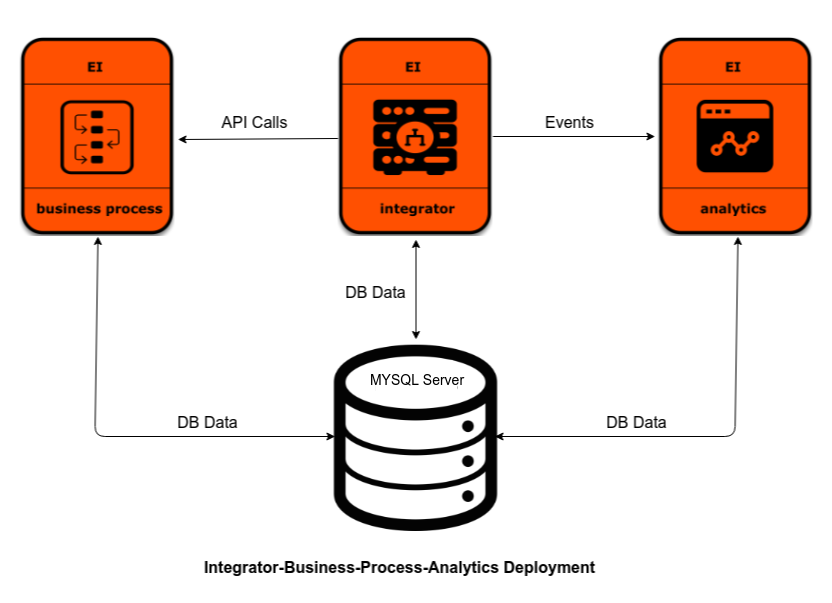

# WSO2 Enterprise Integrator <br> For Integration and Business Process (BPS) <br> Use-cases With Analytics Support



## Prerequisites

 * Install [Git](https://git-scm.com/book/en/v2/Getting-Started-Installing-Git), [Docker](https://www.docker.com/get-docker) and [Docker Compose](https://docs.docker.com/compose/install/#install-compose)
   in order to run the steps provided in following Quick start guide. <br><br>
  * In order to run this Docker Compose setup, you will need an active [Free Trial Subscription](https://wso2.com/free-trial-subscription) 
   from WSO2 since the referring Docker images hosted at docker.wso2.com contains the latest updates and fixes for WSO2 Enterprise Integrator. You can sign up for a Free Trial Subscription [here](https://wso2.com/free-trial-subscription). <br><br>
  * If you wish to run the Docker Compose setup using Docker images built locally, build Integrator, Business Process and Analytics Images using [Dockerfiles](../../dockerfiles/README.md) 
    and remove the `dockerhub.wso2.com/` prefix from the `image` name In the `docker-compose.yml`. For example, change the line `image: dockerhub.wso2.com/wso2ei-analytics:6.1.1` 
    to `image: wso2ei-analytics:6.1.1`. <br><br>
  
## How to Run

  1. Clone WSO2 Enterprise Integrator Docker git repository.
     ```
     git clone https://github.com/wso2/docker-ei
     ```
     > Note that the local copy of `docker-ei` repository will be referred to as `[docker-ei]` from this point onwards.

  2. Switch to docker-compose/integrator-bps-analytics folder :
     ```
     cd [docker-ei]/docker-compose/integrator-bps-analytics
     ```

  3. Execute following Docker Compose command to start the deployment :
     ```
     docker-compose up
     ```

  4. Access management console via a web browser :
     ```
     For Integrator - https://localhost:9443/carbon
     For Analytics - https://localhost:9444/carbon
     For Business Process - https://localhost:9445/carbon
     ```
