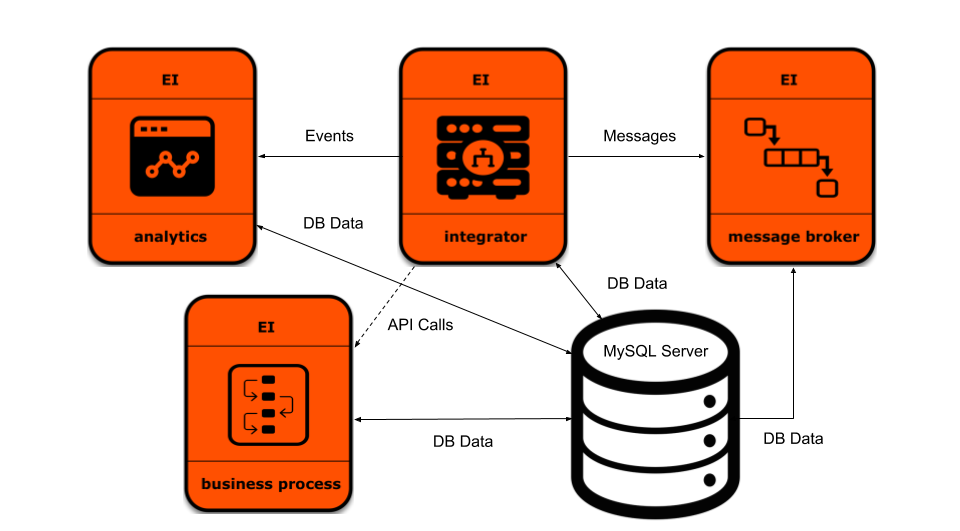

# WSO2 Enterprise Integrator <br> For Integration, Broker and Business Process (BPS) <br> Use-cases With Analytics Support



## Prerequisites

  * [Git](https://git-scm.com/book/en/v2/Getting-Started-Installing-Git), [Docker](https://www.docker.com/get-docker) and [Docker Compose](https://docs.docker.com/compose/install/#install-compose) are required for running this Docker Compose template.
  * In order to run the Docker Compose setup, you will need an active subscription from WSO2 since the 
    Docker images hosted at docker.wso2.com contains the latest updates and fixes to WSO2 Enterprise Integrator. You
    can sign up for a Free Trial Subscription [here](https://wso2.com/free-trial-subscription).
  * If you wish to run the Docker Compose setup using Docker images built locally, build Integrator, Broker, Business Process,
   Analytics Images using [Dockerfiles](../../dockerfiles/README.md) and remove the `docker.wso2.com/` prefix from the `image` name In the `docker-compose.yml`
            
## How to Run

  1. Clone WSO2 API Manager Docker git repository.
     ```
     git clone https://github.com/wso2/docker-ei
     ```
     > Note that the local copy of `docker-ei` repository will be referred to as `[docker-ei]` from this point onwards.

  2. Switch to docker-compose/integrator-broker-bps-analytics folder :
     ```
     cd [docker-ei]/docker-compose/integrator-broker-bps-analytics
     ```

  3. Before to start deployment process, add a host entry pointing to the Docker host machine IP address. <br>
     For an example if the Docker host is accessible via 127.0.0.1 on a Linux or Mac machine, add <br>
     following entry to /etc/hosts file :
     ```
     127.0.0.1 wso2ei-integrator wso2ei-analytics wso2ei-broker wso2ei-business-process
     ```
               
  4. Execute following Docker Compose command to start the deployment :
     ```
     docker-compose up
     ```
     
  5. Access management console via a web browser :

     ```
     For Integrator - https://wso2ei-integrator:9443/carbon
     For Analytics - https://wso2ei-analytics:9444/carbon
     For Business Process - https://wso2ei-business-process:9445/carbon
     For Broker - https://wso2ei-broker:9446/carbon
     ```
