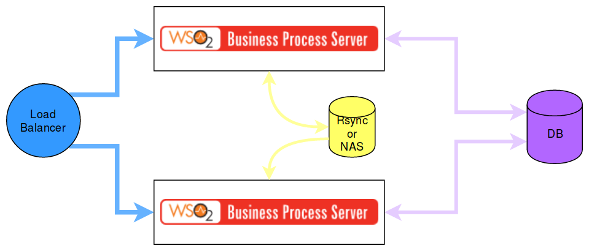

### WSO2 Enterprise Integrator Pattern-7 deployment with Docker compose



#### Pre-requisites

 * Docker
 * Docker compose

#### Docker installation for linux
```
wget -qO- https://get.docker.com/ | sh
```

#### Docker installation for Mac

https://docs.docker.com/docker-for-mac/

#### Docker installation for Windows

https://docs.docker.com/docker-for-windows/

#### Docker Compose Installation

https://docs.docker.com/compose/install/

#### How to run

```
docker login docker.wso2.com 

docker-compose up -d
```

This will deploy the following,

* Mysql server (container) with WSO2_CONFIG_DB, WSO2_REG_DB, WSO2_USER_DB, WSO2_BPMN_DB and WSO2_BPM_DB
* Two business process profile containers run as cluster
* Nginx Load Balancer container

#### How to test

Add the following entries to the /etc/hosts
```
127.0.0.1 ui.business-process.wso2.com business-process.wso2.com
```

If you are using docker machine, please use the docker machine IP instead of the local machine IP.

#### How to access the environment

Business process carbon management console

```
https://ui.business-process.wso2.com/carbon
```
